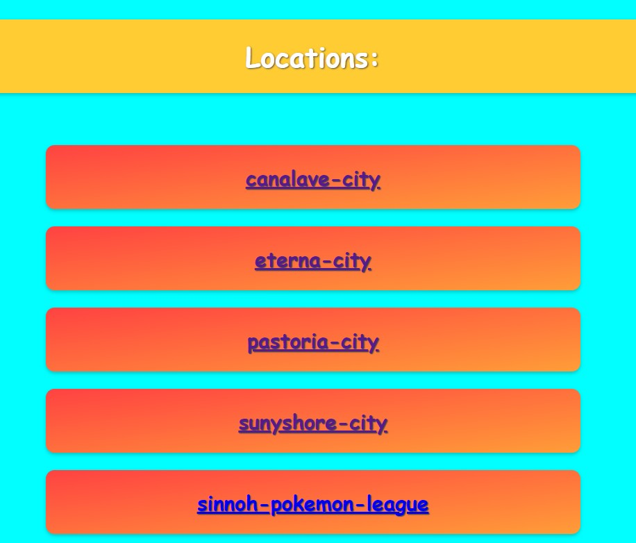

# Simple Pokemon game


## Table of Contents
- [Description](#description)
- [Features](#features)
- [Future Roadmap](#future-roadmap)
- [Technologies Used](#technologies-used)
- [Getting Started](#getting-started)
- [License](#license)

## Description
A web application using the React Router, with a strong focus on the popular game "Pokemon". the project utilises Github Actions, when there is  apush to the main branch, github will compile and upload the frontend's Docker container to DockerHub.

## Features
- Home page with a list of available cities.


- Choose your own Pokemon to battle against a randomly selected enemy from the chosen city.


- Engage in a battle with our interactive battle interface.


## Future Roadmap
- User management
- Pokemon beloning to users and leveling system
- Tournaments and battles

## Technologies Used


## Getting Started

1. Clone the repository:
2. Enter the frontend folder
3. Install dependencies
4. Start the project
5. Access the site through [localhost](http://localhost:3000/)

```
git clone git@github.com:DJHeadset/pokemon.git
cd frontend
npm i
node start
```

## License
This project is open-source and available under the [MIT License](LICENSE).
