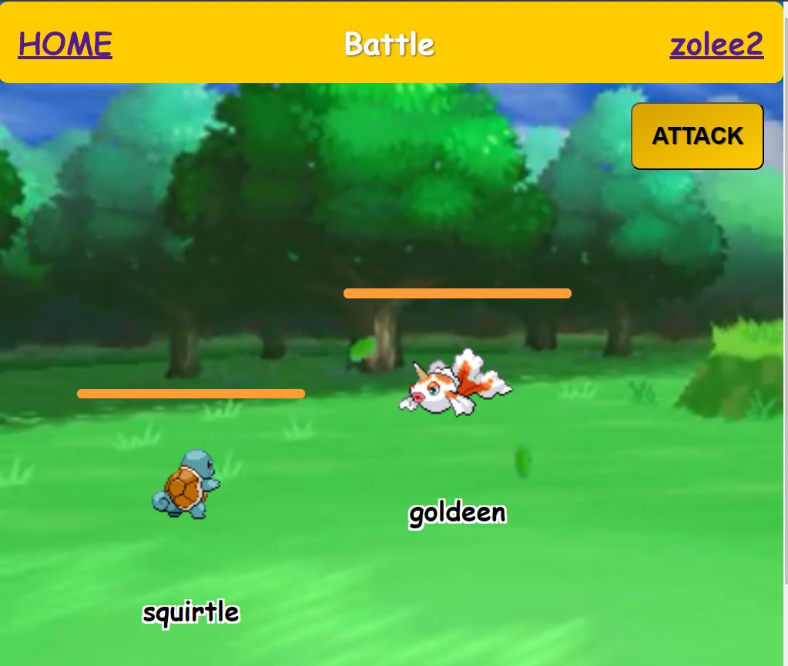

# Simple Pokemon game


## Table of Contents
- [Description](#description)
- [Features](#features)
- [Future Roadmap](#future-roadmap)
- [Technologies Used](#technologies-used)
- [Getting Started](#getting-started)
- [License](#license)

## Description
Welcome to the world of Pokémon! This web application, built using React Router, invites you to embark on an exciting journey inspired by the beloved Pokémon game. The project leverages the power of GitHub Actions, automatically deploying the frontend Docker container to DockerHub upon each push to the main branch.

The application adopts a microservices architecture, with distinct backends managing user controls and Pokémon battles. Security is paramount, ensured through the use of JSON Web Tokens (jsonwebtoken). 


## Features
- Home page with aminated login/sign in.


- Choose your own Pokemon to battle against a randomly selected enemy from the chosen city.


- Engage in a battle with our interactive battle interface.


### Future Roadmap
- **Battle Rework:** Improving and refining the battle mechanics.
- **Player vs. Player (PvP):** Introducing the ability for players to battle each other.
- **Tournaments:** Setting the stage for epic Pokémon tournaments.

## Technologies Used


## Getting Started

1. Clone the repository:
2. Enter the frontend folder
3. Install dependencies
4. Start the project
5. Access the site through [localhost](http://localhost:3000/)

```
git clone git@github.com:DJHeadset/pokemon.git
cd frontend
npm i
node start
```

In a different terminal:
1. Enter the backend folder
2. Install dependencies
3. Start backend

```
cd backend
npm i
npm run dev
```

## License
This project is open-source and available under the [MIT License](LICENSE).

**Note:** Pokémon is a trademark of Nintendo, Game Freak, and Creatures. This project is a fan-made game and is not affiliated with or endorsed by the creators of Pokémon. All Pokémon-related content is the intellectual property of Nintendo, Game Freak, and Creatures. The use of Pokémon in this project is for creative and educational purposes.